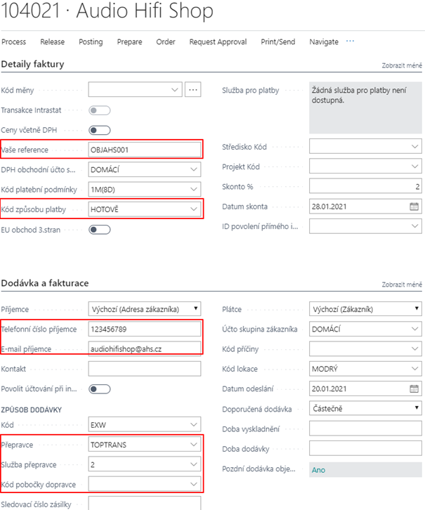
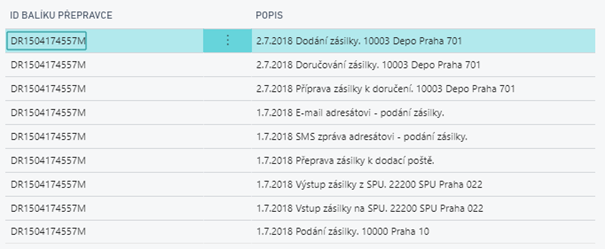

# AC Parcels - Integration Balikobot

The shipments addon is used to create shipments and directly print labels of selected shipping angent, send shipment data to the shipping angent and order the actual parcel collection. With this extension, the process of processing and creating shipments sent to customers is accelerated. This addon uses the API of the Balikobot service.

This addon is built on the basis of reading barcode (numbers) of charged documents. Shipments can be created from posted sales shipments and invoices. If the user will create a shipment from an invoiced sales delivery, the shipment will be created without COD and from invoices with COD.

List of shipping angents:
 - Česká pošta s.p.
 - DACHER Česká republika
 - DHL
 - Direct Parcel Distribution CZ s.r.o.
 - FEDEX
 - Fofr
 - Geis CZ s.r.o.
 - Gebrüder Weiss
 - General Logistics Systems Czech Republic s.r.o.
 - Gebrüder Weiss Česká republika
 - Gebrüder Weiss Slovenská republika
 - Messenger
 - Pošta bez hranic (Frogman s.r.o.)
 - PPL CZ s.r.o. 
 - Raben
 - Spring
 - Slovenská pošta a.s.
 - TNT Express
 - TOPTRANS EU a.s.
 - WE|DO
 - WE DO - Uloženka
 - UPS
 - Zásilkovna s.r.o.

## Creating a sales order
The basic step of the shipment creation process is the sales order. The data from the sales order is transferred to the other documents from which the shipments are created, so it is essential to enter the data correctly at the beginning of the process. (Similarly, shipments can be created from sales invoices.)

### Required fields to be entered before issuing a document
- Customer address
- Shipping Agent Code, Shipping Angent Service Code or Shipping Angent Branch Code.
- Customer's phone number, email or one of the following.
- Payment method code (if COD), variable symbol.
- Your references (if your customer requires a label, e.g.: your order number).

Business Central will not release a receipt if the phone number and/or email is not filled in! (see check settings).
If no shipping angent is selected on the order, the check to release the document (phone number and email is disabled).

### Optional field to be entered before the document is released
The user can already enter optional shipment parameters in the sales order. The **Shipment Parameters** infomation panel on the sales order tab is used to enter them. The insert button opens a window with parameters from the settings, which can be added as required. These can be for example:
- Check the age of the addressee.
- Driver contact.
- Delivery to the floor.
- Morning delivery.
- And many more.

## Shipment card
The consignment card consists of a total of five parts.

### Parcel header
The document header contains only the mandatory data needed to create a shipment, to enter other data such as dimensions or a message to the driver, you must use the Shipment Parameters pane. Each shipping angent and shipping angent service has its own specific parameters that will report a message if the data is incomplete, indicating what data is missing from the shipment.

### Shipment lines
The "Number of Packages" field exists to define the number of packages within a shipment. If the shipment is a parcel shipment (NOT a PALETTE shipment), once the number of parcels is entered, shipment lines will be created with individual shipping angent labels assigned. In the case of a pallet shipment, this field will specify the quantity of one handling unit (multiple lines will not be created, but one line will be created and the quantity will be filled in; e.g.: 3 pallets).
### Other parts

|Part|Description|
|-|-|
|**Shipment Parameters**|Shipment Parameters Selectable.|
|**Attached documents**|In the Attached documents subpage it is possible to see all delivery notes or invoices that have been inserted in one shipment (only functional when the shipment is sent to one address) |**Attached documents**|
|**Contents of shipment**|The contents of a shipment are mainly for shipments outside the EU, where it is necessary to give information about what is in the shipment.

## Creating a new shipment from a posted document

After posting the shipment, the process of creating a shipment for the customer begins. One way is to create a shipment from a delivery note or a charged invoice. By retrieving the invoice number, the **Create Shipment** form is automatically pre-populated. This step eliminates the need for the user to manually fill out the shipment information.

1. Choose the  icon, enter **Create Parcel**, and then choose the related link.
1. Enter the number of the document being charged (posted sales shipment, posted sales invoice) in the **Document Number** field. Or use the Scan Codes function (in case you have a barcode with a receipt number).
1. The user has the option to enter the number of packages within a shipment.
1. Select the **Create Shipment and Print Label** function.
1. The shipment is now created and is also in the **For collection** status, i.e. it has already been assigned a number by the shipping agent. The label and data are on the Balikobot side).

## Manual shipment creation

You can also create shipments manually without accounting documents, e.g.: for sending letters or an additional package. On the shipment overview there is a "New" function which opens a blank shipment card. The Shipments tab and the Create Shipment tab are almost identical. When manually creating a shipment, the posted document number cannot be scanned and the information must be filled in manually. In this creation, you must enter Status on **New** and add one line. Once the data for the shipment is set up, the "Add to Shipment" function will register the shipment in the Balikobot system. Then you must manually print the label.

To create a shipment manually, the steps are as follows:
1. Select the **New** function on the shipment overview.
2. Fill in the necessary fields for the shipper and its service
3. the **Add to collection** function (the shipment is in the **For collection** status and the label can be printed)
4. function **Print label**
5. The shipment is ready to be ordered for collection.

## Shipment edit
Shipments can only be edited if they are in **New** status. If a shipment is in **Collected** status, it cannot be edited. In order to edit/delete shipment information, the shipment must be in the **For Collection** status. Use the Remove From Shipment function to change the status from **For Collection** to **New**.

 After this step, you must notify the shipper that you are deleting or editing the shipment. At this point, the shipment number is removed from the carrier and the label is deleted. Once the data has been edited, the user will use the **For Collection** function and use the **Print Labels** function to print the new label.

1. Choose the  icon, enter **Parcels**, and then choose the related link.
2. Choose on the consignment line and use the **Remove from collection** function.
3. Open the Parcel (it now has a status of **New**)
4. Add data/values about the shipment (change of carrier, number of packages, weight, dimensions...)
5. Use the **Add to collection** function (the shipment is in the **For collection** status and the label can be printed)
6. Next, use the **Print Label** function.
7. The shipment is ready for **Order Collection**.

## Order Collection
Order collection is used to pass information about your shipments to the carrier. The process of ordering a collection is simple, it is done using the "Order collection" function on the shipment overview. 

The function will display a list of carriers with the number of shipments that have not yet been ordered for collection. The user can order a collection only for the selected shipper or for all of them at once.

In order to order a collection, the following steps are required:
1. In the shipment overview, select the **Order Collection** function.
2. On the Order Pickup tab, select whether to order a pickup from one carrier (**Order Collection**) or all carriers (**Order All Collections**).
3.  When the function is initiated, the **Handover report** will print.

## Printing the collection report
The handover report is generated by the haulers.
This report can be set to print automatically when a collection is ordered. The automatic printing settings are in the **Shipment Settings** window. For additional printing of the handover report of the selected shipper, there is a function with the same name on the shipment report, where you just stand on one of the shipments of that shipper on the day of the collection. A list of all shipments from the selected shipper for the specified day will then be printed.

For an additional printout of the collection handover report:
1. Stand on the shipments from that collection and use the **Collection Handover Protocol** function.
2. This will open a PDF file, which will then be printed from the browser window.

## Tracking shipments
In the shipment overview you can see at a glance the status of the shipment. This status is not structured and is only informative without detail. To update this status on the shipment line, use the **Update Track Status** button. 

If you want to view individual shipment statuses from the shipper, use the **Track Status** function on the shipment overview to open the individual shipment status page.

## Checks and restrictions

 - If the Shipping agent Code and Shipping agent Service Code fields are filled out on the sales order, you must enter the recipient's phone number and email. If the fields are not filled in the receipt cannot be released.
 - When entering data on the shipment card (automatically by retrieving codes or manually) there is a **Check Data** function on the shipment card. After running it, you will be informed if the information transmitted is correct.
 - One shipping point can be assigned to one location. A 1:1 relationship is created..

## See Also
[Setup - AC Parcels - Integration Balikobot](ac-parcels-setup.md)  
[AC Productivity Pack](ac-productivity-pack.md)  
[AUTOCONT solutions](../index.md)
